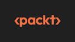

# The 2-day Web Workshop

Have you wanted to learn how to build web sites or web applications and just didn't know where to start?  In this 2-day workshop, we'll cover the very basics of HTML, CSS, and JavaScript to get you started.  Then, we will take those skills and start building with ASP.NET Core, a free framework that allows you to build applications with HTML and C#.  On day 2, we will take our skills even further when we learn about Blazor, another free framework that allows you to build interactive applications with HTML, C#, and standard we technologies.

## Part 1 - HTML + CSS

Part 1 of day 1 is based on the [Terrarium lessons from the Microsoft Web Dev for Beginners Series](https://github.com/microsoft/Web-Dev-For-Beginners/tree/main/3-terrarium).  We will install Visual Studio Code and build our first web page, complete with images and interactions using HTML, CSS, and JavaScript.  You will be able to interact with a web-based terrarium in your web browser that YOU made!

[Get Started with Part 1](./Part%201%20-%20HTML%2BCSS/README.md)

## Part 2 - Programming and Interactivity with ASP.NET Core 

Part 2 of day 1 is based on the [ASP.NET Core for Beginners workshop](https://github.com/dotnet-presentations/aspnetcore-for-beginners).  We will create a simple website that allows us to track some of our favorite movies in a database using simple C# and .NET technology.

[Get Started with Part 2](./Part%202%20-%20ASP.NET%20Core/README.md)

## Part 3 - Interactive Web Applications with Blazor

Part 3 is our adventure on day 2 and is the [Blazing Pizza workshop](https://github.com/dotnet-presentations/blazor-workshop).  We will create a web application for a new pizza shop called 'Blazing Pizza' that allows customers to browse, order, and customize pizzas. The application runs both on a web server AND in your browser.

[Get Started with Part 3]()

## Sponsors

We wouldn't be able to deliver the 2 day workshop event without help from our sponsors:

