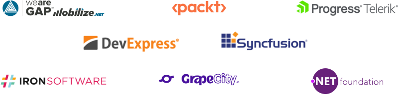

# The 2-day Web Workshop

Have you wanted to learn how to build web sites or web applications and just didn't know where to start?  In this 2-day workshop, we'll cover the very basics of HTML, CSS, and JavaScript to get you started.  Then, we will take those skills and start building with ASP.NET Core, a free framework that allows you to build applications with HTML and C#.  On day 2, we will take our skills even further when we learn about Blazor, another free framework that allows you to build interactive applications with HTML, C#, and standard we technologies.

## Part 1 - HTML + CSS

Part 1 of day 1 is based on the [Terrarium lessons from the Microsoft Web Dev for Beginners Series](https://github.com/microsoft/Web-Dev-For-Beginners/tree/main/3-terrarium).  We will install Visual Studio Code and build our first web page, complete with images and interactions using HTML, CSS, and JavaScript.  You will be able to interact with a web-based terrarium in your web browser that YOU made!

[Get Started with Part 1](./Part%201%20-%20HTML%2BCSS/README.md)

## Part 2 - Programming and Interactivity with ASP.NET Core 

Part 2 of day 1 is based on the [ASP.NET Core for Beginners workshop](https://github.com/dotnet-presentations/aspnetcore-for-beginners).  We will create a simple website that allows us to track some of our favorite movies in a database using simple C# and .NET technology.

[Get Started with Part 2](./Part%202%20-%20ASP.NET%20Core/README.md)

## Part 3 - Interactive Web Applications with Blazor

Part 3 is our adventure on day 2 and is the [Blazing Pizza workshop](https://github.com/dotnet-presentations/blazor-workshop).  We will create a web application for a new pizza shop called 'Blazing Pizza' that allows customers to browse, order, and customize pizzas. The application runs both on a web server AND in your browser.

[Get Started with Part 3](./Part%203%20-%20Blazor/README.md)

## Sponsors

We wouldn't be able to deliver the 2 day workshop event without help from our sponsors:

- [DevExpress](https://devexpress.com) - Your Next Great Blazor App Starts Here. Download our free 30-Day Blazor UI trial and Experience the DevExpress Difference today.

- [Global Acceleration Partners](https://www.growthaccelerationpartners.com/)

- [GrapeCity](https://bit.ly/45UmMzJ) - ComponentOne and ActiveReports .NET from GrapeCity deliver UI, grids, and reporting to build modern web and Blazor applications.

- [IronSoftware](https://ironsoftware.com)

- [.NET Foundation](https://dotnetfoundation.org/)

- [Packt Publishing](https://packtpub.com) - Check out Packt's great Blazor books: 
  - [Develop modern web UIs with Blazor Server and Blazor WebAssembly](https://www.amazon.com/Web-Development-Blazor-depth-interactive/dp/1803241497/ref=pd_bxgy_vft_none_sccl_1/138-7885948-7808608?pd_rd_w=DOd6X&content-id=amzn1.sym.26a5c67f-1a30-486b-bb90-b523ad38d5a0&pf_rd_p=26a5c67f-1a30-486b-bb90-b523ad38d5a0&pf_rd_r=QQFMSJR4Q1Q87VMZFGN9&pd_rd_wg=WZvQW&pd_rd_r=3bec420a-a40b-42f7-af6a-6c9f2fcf8dfa&pd_rd_i=1803241497&psc=1)
  - [Build exciting web apps following step-by-step instructions and video examples with Blazor Webassembly By Example](https://www.amazon.com/Blazor-WebAssembly-Example-practical-projects/dp/1803241853/ref=pd_vtp_h_vft_none_pd_vtp_h_vft_none_sccl_4/138-7885948-7808608?pd_rd_w=Ncxq7&content-id=amzn1.sym.a5610dee-0db9-4ad9-a7a9-14285a430f83&pf_rd_p=a5610dee-0db9-4ad9-a7a9-14285a430f83&pf_rd_r=6QF3GV3SAKHV9FF750MZ&pd_rd_wg=Ba8gf&pd_rd_r=1d7105be-d749-4728-bdd0-634eec7fb09c&pd_rd_i=1803241853&psc=1)

- [SyncFusion](https://syncf.co/45Blvxc) - Syncfusion offers 80+ UI and Data Viz web Blazor components  like DataGrid, Charts, and Scheduler, that are responsive and lightweight. 

- [Progress - Telerik](https://telerik.com)